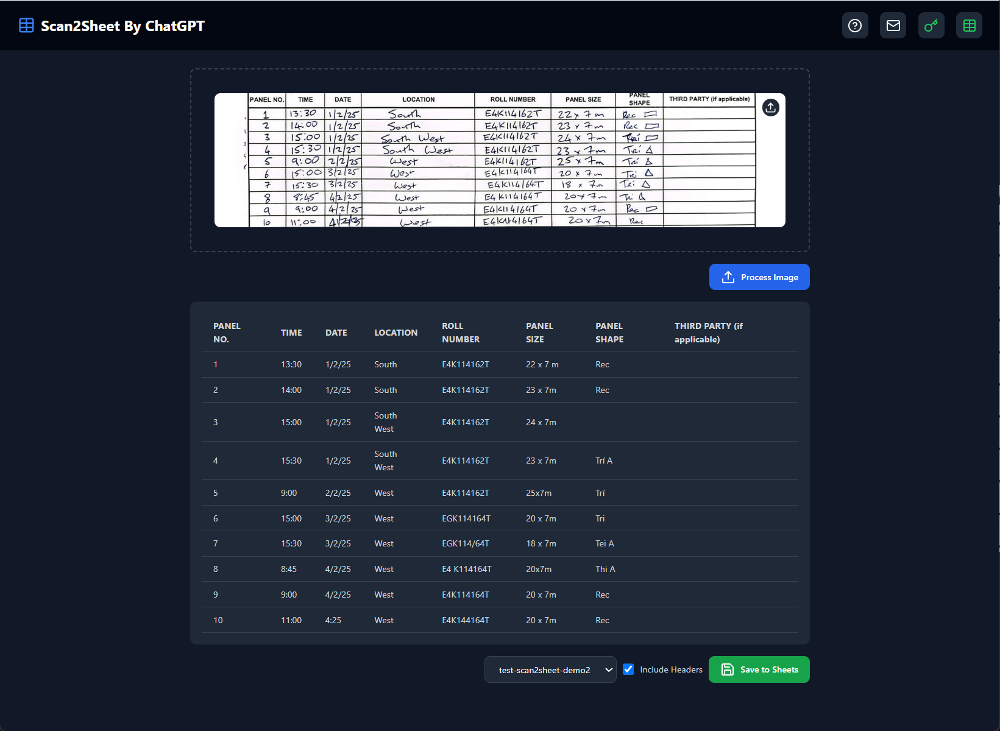
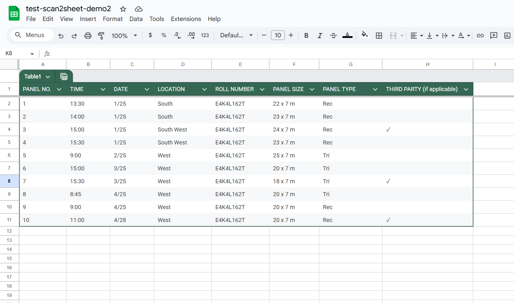

# Scan2Sheet - Powered by ChatGPT

Effortlessly convert handwritten tables and scanned documents to Google Sheets, powered by ChatGPT and Google Gemini AI.

## Key Features

✨ Smart Recognition
- Automatically detect and recognize table content from images
- Support handwritten text, printed documents, and scanned materials
- Intelligent error correction for improved accuracy

📊 Table Processing
- Convert recognized content into structured tables
- Preserve original table format and layout
- Preview and edit recognition results

📝 Google Sheets Integration
- One-click save to Google Sheets
- Select target spreadsheet
- Automatic data synchronization

🛠️ Easy Setup
- Simple Google account authorization
- Configure default save location
- Customize save rules

## Use Cases

✓ Handwritten Data Digitization
- Convert handwritten tables to digital spreadsheets
- Automatic recognition with OCR technology
- Eliminate manual data entry

✓ Receipt Data Extraction
- Scan business receipts and extract data automatically
- Generate profit & loss statements and expense reports quickly
- Streamline financial processing

✓ Meeting Notes Organization
✓ Paper Form Digitization
✓ Student Assignment Grading
✓ Data Entry Automation
✓ Document Scanning Archive

## Why Choose Scan2Sheet?

🚀 Enhanced Efficiency
- Save time on manual data entry
- Reduce human errors
- Process in batch more efficiently

🎯 Reliable Accuracy
- ChatGPT intelligent recognition
- Automatic error correction
- Human verification mechanism

🔒 Secure & Reliable
- Secure Google authorization
- Local data processing
- Privacy protection

💡 User-Friendly
- Intuitive interface
- Simple operation
- No professional training needed

## Technical Support

For questions or suggestions, please:
- Visit our support page: https://scan2sheet.aluo.app
- Submit issues: https://github.com/aluoapp/scan-to-googlesheets/issues
- Contact us: team@aluo.app

## Privacy Statement

We value your privacy. This extension:
- Only requests necessary permissions
- Does not collect personal information
- Does not share user data
- All operations are performed locally

Start using Scan2Sheet and make document processing easier!

  

  

